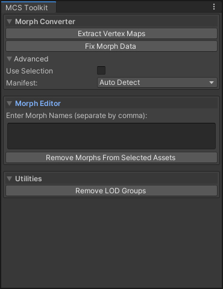

# MCS Toolkit
Toolkit for making the MCS avatar system (v1.7) work in Unity 2019 and beyond.

## The issue.
With version 2018.4, Unity introduced a new way of optimizing mesh on import, which reorders the vertices of a model's meshes. Unfortunately, MCS meshes have their blendshapes (morphs) stored in external files that aren't automatically updated to this new order. As a result, the morphs don't work in newer versions of Unity.

More information on the issues of MCS in Unity 2019 and other fixes can be found in this thread the Unity forums: <https://forum.unity.com/threads/released-morph-character-system-mcs-male-and-female.355675>.

## Installing 
1. Create a new project in Untiy 2019.1 or newer.
2. From <https://github.com/mcs-sdk/mcs/releases>, download and import your MCS packages. The CodeAndShaders.unitypackage and the female or male base package are mandatory; add whatever additional clothing/hair packs you have and need.
3. Download and import mcs-toolkit.unitypackage from <https://github.com/erikvdb/mcs-toolkit/releases>, or copy this repo into your Assets folder.

### [Optional] Patch MCS_Importer.dll
The MCS_Importer plugin has a bug that may cause issues with morphs during runtime, depending on your system's region settings. A unitypackage with patched MCS_Importer.dll is included with this toolkit release. If you have your own modified plugin(s) already, see <https://github.com/erikvdb/mcs/commit/02fac8dc6fa6a2dd14db8b4a2119d21324990d5b> for the solution to apply.

### [Optional] URP Shader support
URP compatible shaders for MCS are included in the toolkit release. The toolkit includes an option to convert all MCS materials to these new shaders. The shaders can be modified in ShaderGraph.

## Usage
Open the MCS Toolkit editor window from the MCS menu in the top bar.

### Morph Converter
Tools for fixing morph files in 2019. This is a two-step process:
1. Create a new project in a Unity version MCS 1.7 natively works in (i.e. up to 2018.3). Import all your MCS assets and the MCS Toolkit as before. No need to drag them into the scene. Select "Extract Vertex Maps" from the MCS Toolkit window. This will extract vertex maps for ALL meshes found in the Assets/MCS/Content folder. We need these vertex maps as reference for fixing the morph files in Unity 2019+. 
2. Copy the extracted vertex maps into your Unity 2019+ project and select "Fix Morph Data" from the MCS Toolkit. This will try to convert the morph files for all content found in the Assets/MCS/Content folder. It will skip files have already previously been converted using this tool (or my previous mcs-converter). This process may take a while.

#### Advanced Options
Use Selection: Only extract or fix selected folders from the Project panel, instead of processing the entire Content folder. This is helpful if you only need to convert a few items or want to prevent converting files that have been previously converted using a different tool.

Manifest: The morph converter needs to know whether a costume item was made for MCSFemale or MCSMale, something that is surprisingly difficult to tell reliably just from looking at the files. The autodetection method I settled on seems to work with everything I threw at it, but in the off-chance that it fails, (for instance if you are using custom items), you can force the converter to use a certain manifest.

Expanding Advanced options will also enable both Extract and Fix buttons, where by default they are only enabled for Unity versions that they were intended for (so you don't accidentally hit the wrong one).

### Morph Editor
Tools for editing morphs. Currently the only option is to remove morphs from selected assets. This has come in handy a number of times, when for instance part of the hair would move unnaturally with eye blink morphs. 

1. Enter the morph names (e.g. eCTRLEyesClosed) of the morphs you wish to remove into the text field. When entering multiple morphs, separate by comma (,).
2. Select the folders of the assets you wish to remove the morphs from in the Project panel
3. Select "Remove Morphs From Selected Assets" from the MCS Toolkit window. This process may take a while.

### Utilities
Misc. utilities. Currently the only option is for removing LOD Group components from MCS models. In Unity 2019 and later, Unity automatically adds this component to the models when it detects multiple LOD (level of detail) meshes are included. However, LOD should be controlled using MCS's built-in LOD selector. With your MCS Character Manager(s) selected in the scene, press "Remove LOD Groups" in the MCS Toolkit window to remove Unity's LOD Group component from all attached models.

## Shader Conversion
When using the Universal Render Pipeline, the MCS Toolkit adds material conversion options to the MCS menu (similar to Edit/Render Pipeline/Universal Render Pipeline). It will try to convert all/selected MCS materials to the shaders added to this release, or with the same names:
- MCS/URP/EyeAndLash
- MCS/URP/Skin
- MCS/URP/Standard
Note: original MCS models used a variety of shaders, not all of which will be converted automatically, so you may have to change a few manually.

## Troubleshooting
*I don't see any morphs when I adjust the sliders apart from the very first one.*\
Make sure GPU Skinning is turned OFF in player options.

*I'm getting build errors saying "Assembly UnityEditor is referenced in MCS_Importer"*\
Select MCS_Importer.dll and under Select platforms for plugin, only include Editor.

*I've converted the morph data but the morphs still don't look right*\
If the MCS character and/or their clothes seem to disappear when you drag a morph slider, you need to patch the MCS_Importer. Otherwise, try detaching all morphs (select "Detach All" in MCS Character Manager component) or rebooting Unity.

*Something doesn't work in my version of Unity!*\
The MCS Toolkit was made and tested with Unity 2017.4.38f1 and Unity 2019.4.0f1. Up to 2018.3 should behave like 2017, 2018.4 and beyond should behave like 2019, but no guarantees.
